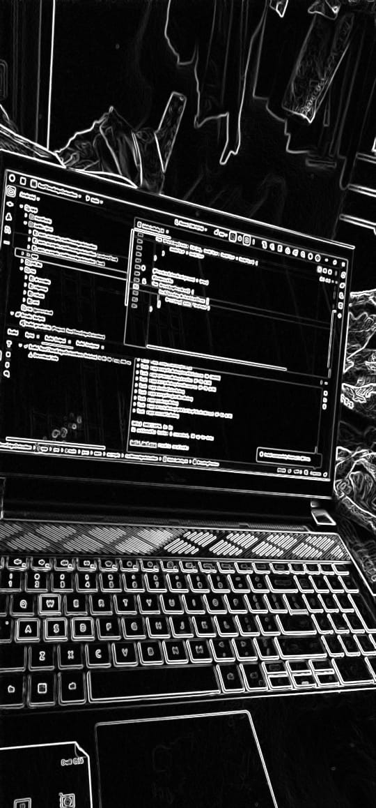
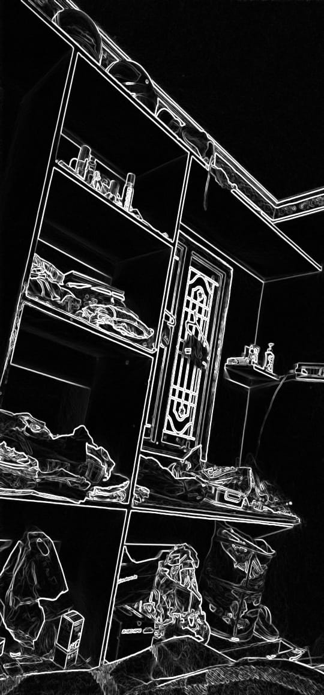

# Real-Time Edge Detection (Android + Web)

A cross-platform project that demonstrates real-time image edge detection on Android with a lightweight companion Web viewer.

- ✅ Features implemented (Android + Web)
- 📷 Screenshots/GIFs of the working app (you will add)
- ⚙ Setup instructions (NDK, OpenCV)
- 🧠 Architecture overview (JNI, frame flow, TypeScript)


## 1) What problem it solves and technologies used

- **Problem statement**
  - Real-time edge detection on mobile devices is computation-heavy and requires efficient native processing to maintain high FPS. This project shows how to: capture camera frames, convert them to a native-friendly format, process edges via C++/OpenCV through JNI, and return PNG bytes for display or sharing.
  - A small **Web viewer** helps visualize output images and monitor FPS/resolution during development.

- **Technologies used**
  - **Android**: Kotlin, Jetpack (Compose UI present), Android Camera image format handling (`YUV_420_888` to `NV21`).
  - **JNI/NDK**: Native bridge (`NativeBridge`) loading `native-lib` and exposing `processFrameNV21ToPNG(...)`.
  - **C++/OpenCV**: Native pipeline for YUV/NV21 decoding and edge detection (e.g., Canny), returning PNG bytes back to Kotlin.
  - **Build**: Gradle + CMake (CMake 3.22.1), ABIs: `arm64-v8a`, `armeabi-v7a`.
  - **Web**: TypeScript + Vite dev server. Simple UI to show the latest processed image, FPS, and resolution.


## 2) Features

- **Real-time native edge detection**
  - Captures camera frames and converts YUV_420_888 format to NV21.
  - Processes frames through JNI bridge to native C++ code for edge detection using OpenCV.

- **Fast frame conversion**
  - Efficient handling of camera planes and strides to build packed NV21 buffers.

- **Portable native pipeline**
  - NDK and CMake integration for building native libraries.
  - Supports multiple ABIs: arm64-v8a and armeabi-v7a.

- **Web companion viewer**
  - Lightweight TypeScript + Vite web app to visualize processed images.
  - Real-time FPS tracking and resolution display.


## 3) Screenshots / GIFs

### Android Studio with Edge Detection

*Development environment showing edge detection processing in real-time*

### Edge Detection Output

*Real-world edge detection applied to scene - showcasing the Canny edge algorithm*

### Web Viewer Interface

*Web companion viewer running at localhost:5173 with FPS tracking and resolution display*


## 4) Setup (Android Studio)

- **Prerequisites**
  - Android Studio (latest stable)
  - Android SDK 34, minSdk 24 (see `app/build.gradle.kts`)
  - **NDK** and **CMake** installed via Android Studio SDK Manager
    - CMake version: `3.22.1` (as declared in Gradle)
    - NDK: any recent LTS compatible with your AGP version

- **OpenCV for Android (native)**
  - Download the OpenCV Android SDK.
  - Add OpenCV include/libs in your native build. Typically:
    - Place the OpenCV SDK under `app/src/main/cpp/third_party/opencv-android/` (or any path you prefer)
    - Reference headers and prebuilt libs in `src/main/cpp/CMakeLists.txt` using `include_directories()` and `target_link_libraries()` (e.g., `opencv_core`, `opencv_imgproc`, `opencv_imgcodecs`).
  - Ensure `c++_shared` is packaged if your OpenCV build depends on it.

- **Gradle/Build settings**
  - `app/build.gradle.kts` highlights:
    - `externalNativeBuild.cmake.path = file("src/main/cpp/CMakeLists.txt")`
    - ABIs: `arm64-v8a`, `armeabi-v7a` (in `defaultConfig.ndk.abiFilters`)
    - Compose enabled, JVM target 11

- **Run**
  1. Open the project in Android Studio.
  2. Sync Gradle.
  3. Connect a device (Android 7.0+, API 24+).
  4. Build and run. The app will load `native-lib` and process frames via `NativeBridge`.

- **Notes**
  - Make sure `src/main/cpp/` contains your native implementation for `processFrameNV21ToPNG(...)` and a matching `CMakeLists.txt` that finds/links OpenCV and produces `libnative-lib.so`.


## 5) Quick architecture explanation

- **High level**
  - Camera produces frames as `Image` (`YUV_420_888`).
  - `YuvUtils.toNV21(image)` builds `NV21` byte array respecting plane strides and interleaving VU.
  - `NativeBridge.processFrameNV21ToPNG(nv21, width, height)` sends the frame to C++ via JNI.
  - C++/OpenCV converts NV21 to grayscale/BGR, runs edge detection (e.g., Canny), encodes result to PNG bytes, and returns to Kotlin.
  - Kotlin UI displays the PNG (e.g., via `BitmapFactory.decodeByteArray` then `ImageView`/Compose).

- **JNI boundary**
  - `System.loadLibrary("native-lib")` in `NativeBridge.kt` loads your `.so`.
  - A native function `Java_com_example_realtimeedgedetection_NativeBridge_processFrameNV21ToPNG(...)` must be implemented in C++.

- **Web companion (`web/`)**
  - `web/main.ts` references DOM elements `edgeImage`, `fps`, `res`, `reloadBtn`.
  - It updates FPS with `requestAnimationFrame`, shows image resolution on `load`, and cache-busts the image URL on reload.
  - Intended use during development: point `edgeImage.src` to the latest processed PNG that your Android app or a tooling script exposes (e.g., via an HTTP endpoint or a periodically updated file served by Vite).


## 6) Clone and run (GitHub) + License

- **Clone**
  ```bash
  git clone https://github.com/sathish0416/RealTimeEdgeDetection.git
  cd RealTimeEdgeDetection
  ```

- **Android app**
  - Open in Android Studio and run, as described above.

- **Web viewer**
  ```bash
  # In a new terminal
  cd web
  npm install
  npm run dev
  # Open the local URL that Vite prints (e.g., http://localhost:5173)
  # Ensure edgeImage.src points to a reachable PNG endpoint or file being updated
  ```

- **License (MIT)**

  Copyright (c) 2025 Sathish Madanu

 
