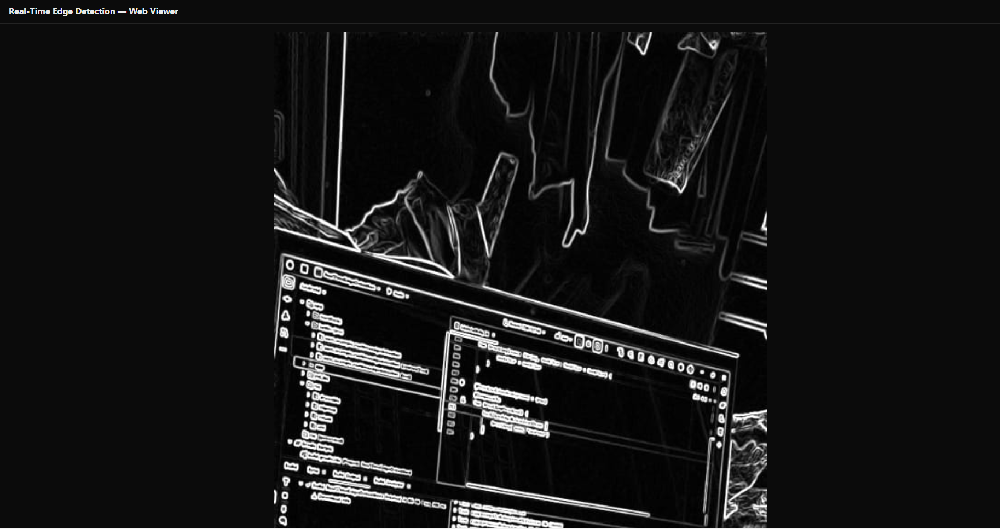
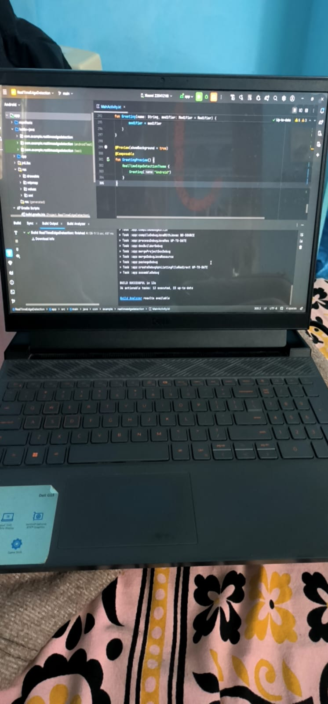
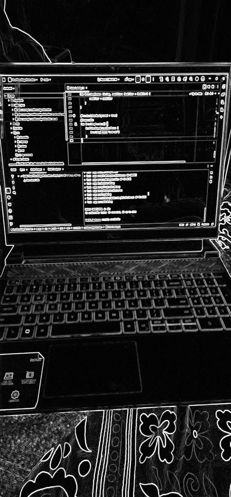
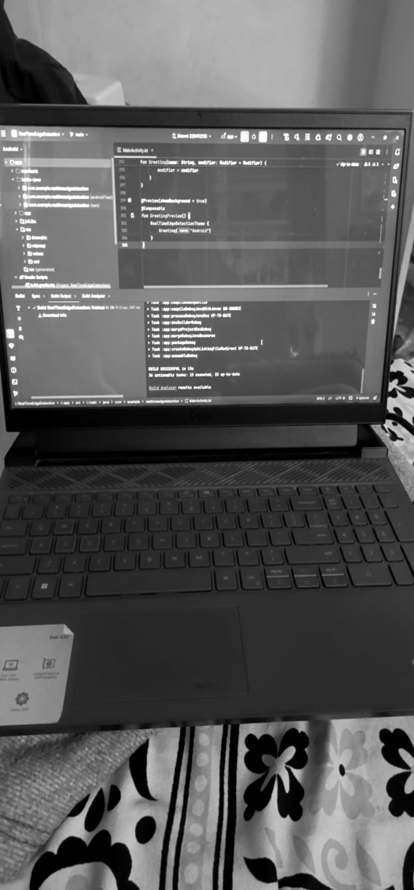
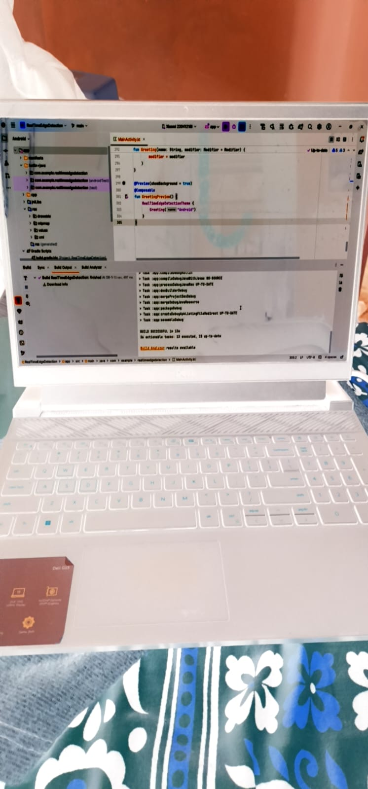
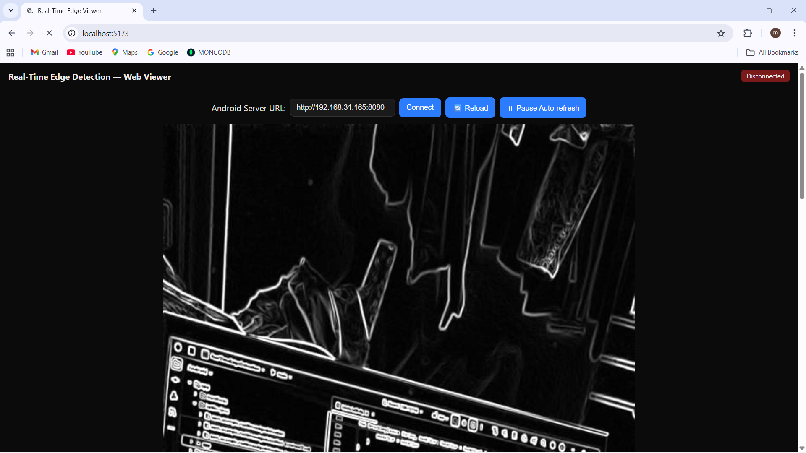

# Real-Time Edge Detection (Android + Web)

A cross-platform project that demonstrates real-time image edge detection on Android with a lightweight companion Web viewer.

- ✅ Features implemented (Android + Web)
- 📷 Screenshots/GIFs of the working app (you will add)
- ⚙ Setup instructions (NDK, OpenCV)
- 🧠 Architecture overview (JNI, frame flow, TypeScript)


## 1) What problem it solves and technologies used

- **Problem statement**
  - Real-time edge detection on mobile devices is computation-heavy and requires efficient native processing to maintain high FPS. This project shows how to: capture camera frames, convert them to a native-friendly format, process edges via C++/OpenCV through JNI, and return PNG bytes for display or sharing.
  - A small **Web viewer** helps visualize output images and monitor FPS/resolution during development.

- **Technologies used**
  - **Android**: Kotlin, Jetpack (Compose UI present), Android Camera image format handling (`YUV_420_888` to `NV21`).
  - **JNI/NDK**: Native bridge (`NativeBridge`) loading `native-lib` and exposing `processFrameNV21ToPNG(...)`.
  - **C++/OpenCV**: Native pipeline for YUV/NV21 decoding and edge detection (e.g., Canny), returning PNG bytes back to Kotlin.
  - **Build**: Gradle + CMake (CMake 3.22.1), ABIs: `arm64-v8a`, `armeabi-v7a`.
  - **Web**: TypeScript + Vite dev server. Simple UI to show the latest processed image, FPS, and resolution.


## 2) Features

- **Real-time GPU edge detection with OpenGL ES 2.0**
  - Captures camera frames and renders with real-time shader-based processing
  - Multiple visual modes: Raw feed, Edge detection (Sobel), Grayscale, and Color invert
  - Smooth 30+ FPS performance on modern Android devices

- **Interactive UI controls**
  - **Toggle Mode button**: Cycle through Raw → Edge → Grayscale → Invert modes
  - **Capture button**: Save current frame as PNG to device storage
  - **Live FPS counter**: Real-time display of rendering performance
  - **Mode indicator**: Shows current active shader mode

- **OpenGL shader effects**
  - Raw camera feed: Direct passthrough rendering
  - Edge detection: Real-time Sobel edge detection on GPU
  - Grayscale: Luminance-based grayscale conversion
  - Invert: Color inversion effect

- **Embedded HTTP server**
  - Built-in NanoHTTPD server runs on port 8080
  - Exposes REST API endpoints for live frame streaming
  - WebSocket-style image streaming at ~5 FPS to web viewer
  - Real-time stats endpoint (FPS, mode, timestamp)

- **Enhanced web companion viewer**
  - Connect to Android device via HTTP (http://device-ip:8080)
  - Live streaming of processed frames from Android
  - Real-time FPS and mode display
  - Auto-refresh with pause/resume controls
  - Static file viewing mode for saved PNGs
  - Connection status indicator

- **Fast frame conversion**
  - Efficient handling of camera planes and strides to build packed NV21 buffers.

- **Portable native pipeline**
  - NDK and CMake integration for building native libraries.
  - Supports multiple ABIs: arm64-v8a and armeabi-v7a.


## 3) Bonus Features ✨

This project includes several advanced bonus features:

- **Toggle Button**: Cycle through 4 visual modes (Raw, Edge, Grayscale, Invert) with a single button tap. All processing happens on GPU via OpenGL ES 2.0 shaders.

- **FPS Counter**: Real-time performance tracking displayed in top-left overlay. Typically achieves 30+ FPS on modern Android devices.

- **OpenGL Shader Effects**: GPU-accelerated visual effects including Sobel edge detection with 3x3 convolution kernel, luminance-based grayscale conversion, and color inversion.

- **HTTP Server**: Embedded NanoHTTPD server on port 8080 streams frames to web viewers at ~5 FPS. Exposes REST API for images, stats, and saved files.

- **Enhanced Web Viewer**: Connect to Android device via HTTP for live streaming. Features auto-refresh controls, connection status indicator, and dual mode support (live streaming or static file viewing).

See screenshots below for visual demonstrations of these features.


## 4) Screenshots / GIFs

### Core Features (3 screenshots)


*Development environment showing edge detection processing in real-time*


*Real-world edge detection applied to scene - showcasing the Canny edge algorithm*



*Web companion viewer running at localhost:5173 with FPS tracking and resolution display*

### Bonus Features - Toggle Modes (4 screenshots)


*Raw camera feed mode - direct passthrough without processing*



*Edge detection mode - real-time Sobel operator with GPU acceleration*



*Grayscale mode - luminance-based conversion*



*Color invert mode - full RGB inversion effect*

### Bonus Features - Web Viewer (3 screenshots)


*Web viewer connection UI - enter device IP and connect for live streaming*


*Live streaming from Android device with real-time FPS and mode display*


*Web viewer controls - pause/resume auto-refresh and manual reload*


## 5) Setup (Android Studio)

- **Prerequisites**
  - Android Studio (latest stable)
  - Android SDK 34, minSdk 24 (see `app/build.gradle.kts`)
  - **NDK** and **CMake** installed via Android Studio SDK Manager
    - CMake version: `3.22.1` (as declared in Gradle)
    - NDK: any recent LTS compatible with your AGP version

- **OpenCV for Android (native)**
  - Download the OpenCV Android SDK.
  - Add OpenCV include/libs in your native build. Typically:
    - Place the OpenCV SDK under `app/src/main/cpp/third_party/opencv-android/` (or any path you prefer)
    - Reference headers and prebuilt libs in `src/main/cpp/CMakeLists.txt` using `include_directories()` and `target_link_libraries()` (e.g., `opencv_core`, `opencv_imgproc`, `opencv_imgcodecs`).
  - Ensure `c++_shared` is packaged if your OpenCV build depends on it.

- **Gradle/Build settings**
  - `app/build.gradle.kts` highlights:
    - `externalNativeBuild.cmake.path = file("src/main/cpp/CMakeLists.txt")`
    - ABIs: `arm64-v8a`, `armeabi-v7a` (in `defaultConfig.ndk.abiFilters`)
    - Compose enabled, JVM target 11

- **Run**
  1. Open the project in Android Studio.
  2. Sync Gradle.
  3. Connect a device (Android 7.0+, API 24+).
  4. Build and run. The app will load `native-lib` and process frames via `NativeBridge`.

- **Notes**
  - Make sure `src/main/cpp/` contains your native implementation for `processFrameNV21ToPNG(...)` and a matching `CMakeLists.txt` that finds/links OpenCV and produces `libnative-lib.so`.


## 6) Using the app

### Android Controls

The app displays two buttons at the bottom:
- **Toggle Mode**: Cycles through visual effects
  - Raw: Original camera feed
  - Edge: Real-time Sobel edge detection
  - Grayscale: Luminance-based conversion
  - Invert: Color inversion effect
- **Capture**: Saves the current frame as PNG to device storage

The top-left overlay shows:
- **FPS**: Real-time frames per second
- **Mode**: Current active shader mode

### Live Web Streaming

The app automatically starts an HTTP server on port 8080 when launched. To view the live stream:

1. **Find your device IP**: Settings → About → Status → IP address (e.g., `192.168.1.100`)
2. **Access from browser**: 
   - Direct access: `http://<device-ip>:8080` (embedded viewer)
   - Via Vite dev server: Run web viewer and connect to device URL
3. **Controls**: 
   - The web viewer auto-refreshes every 200ms for smooth playback
   - Use "Pause Auto-refresh" to stop updates
   - "Reload" button manually refreshes the current frame

### Saved Images

Captured images are saved to the device's external files directory:
- Path: `/sdcard/Android/data/com.example.realtimeedgedetection/files/`
- Filename format: `edge_live_<timestamp>.png`
- Access via device file manager or ADB

## 7) Quick architecture explanation

- **High level (GPU rendering pipeline)**
  - Camera produces frames as `Image` (`YUV_420_888`) and outputs to `SurfaceTexture`
  - `GLCameraRenderer` receives camera frames via OpenGL external texture (`OES_EGL_image_external`)
  - Fragment shader processes each frame on GPU:
    - Mode 0 (Raw): Direct passthrough
    - Mode 1 (Edge): Sobel edge detection with 3x3 convolution kernel
    - Mode 2 (Grayscale): Luminance-based conversion
    - Mode 3 (Invert): Color inversion
  - Rendered output displayed at 30+ FPS via `GLSurfaceView`
  - Every 10th frame is captured as PNG and sent to HTTP server for web streaming

- **JNI boundary**
  - `System.loadLibrary("native-lib")` in `NativeBridge.kt` loads your `.so`.
  - A native function `Java_com_example_realtimeedgedetection_NativeBridge_processFrameNV21ToPNG(...)` must be implemented in C++.

- **Web companion (`web/`)**
  - `web/main.ts` references DOM elements for live connection to Android device
  - Supports both static mode (viewing saved PNGs) and live mode (HTTP streaming)
  - Auto-reconnect and connection status indicator
  - Real-time stats display (FPS, mode, resolution)

- **HTTP Server API Endpoints**
  - `GET /` - Serves embedded web viewer UI
  - `GET /api/latest-image` - Returns latest processed frame as PNG
  - `GET /api/stats` - Returns JSON with `{fps, mode, timestamp}`
  - `GET /api/image/{filename}` - Serves saved images from device storage


## 8) Clone and run (GitHub) + License

- **Clone**
  ```bash
  git clone https://github.com/sathish0416/RealTimeEdgeDetection.git
  cd RealTimeEdgeDetection
  ```

- **Android app**
  - Open in Android Studio and run, as described above.

- **Web viewer (two modes)**
  
  **Option 1: Live streaming from Android device**
  1. Run the Android app on your device
  2. Connect your device and computer to the same WiFi network
  3. Find your Android device's IP address (Settings → About → Status → IP address)
  4. Open the web viewer:
     ```bash
     cd web
     npm install
     npm run dev
     # Open http://localhost:5173 in your browser
     ```
  5. In the web UI, enter your Android device URL (e.g., `http://192.168.1.100:8080`)
  6. Click "Connect" to start live streaming
  7. You can also directly open `http://<device-ip>:8080` in your browser for the embedded viewer
  
  **Option 2: Static PNG viewing**
  1. Place a PNG file at `web/assets/edge_sample.png`
  2. Run the web dev server and it will display the static image
  3. Use the "Reload" button to refresh

- **License (MIT)**

  Copyright (c) 2025 Sathish Madanu

 
